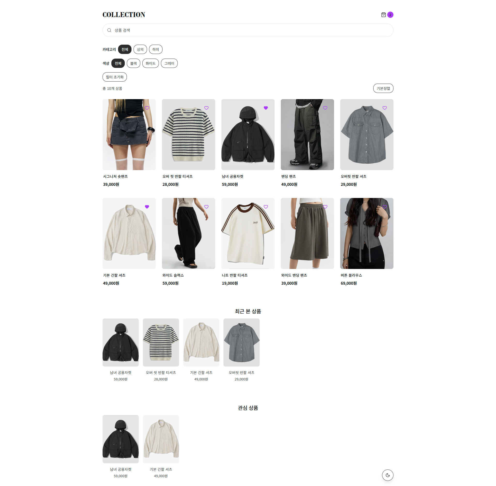
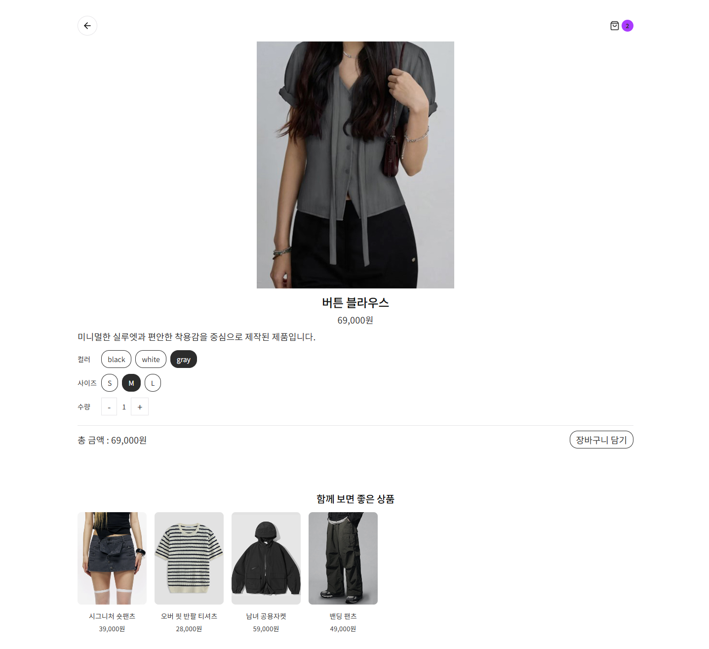
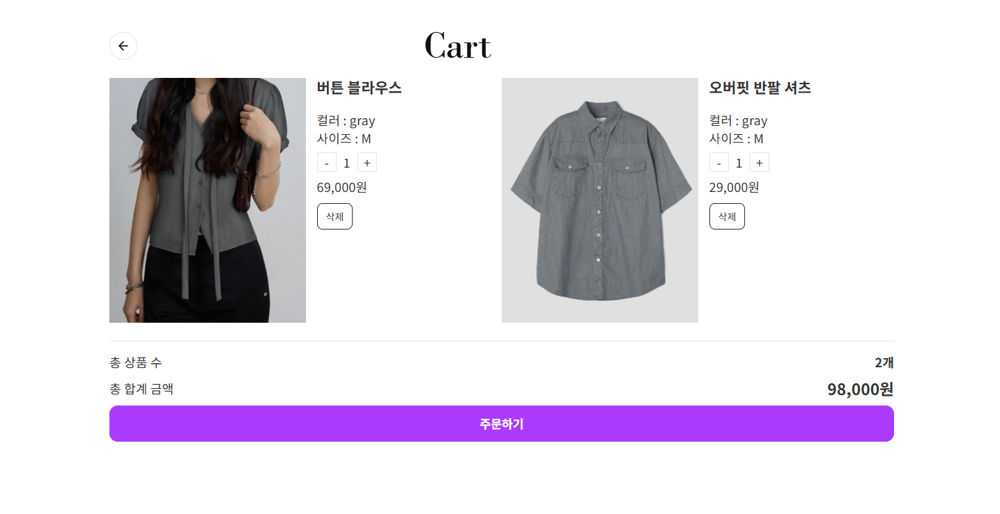
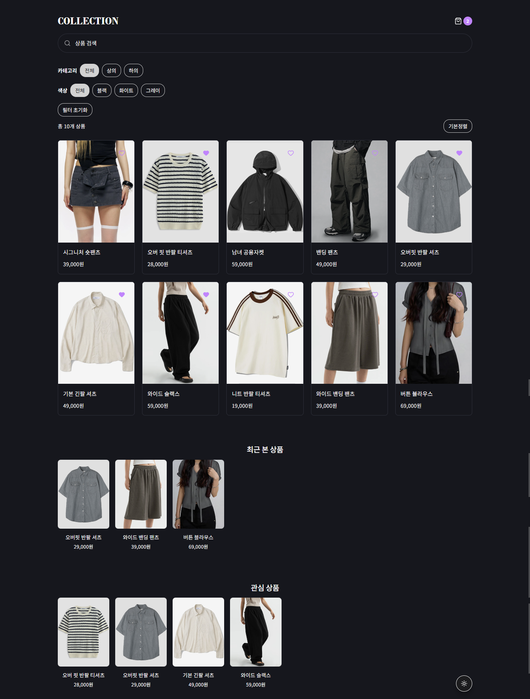

# Minimal Ecommerce

> 상품 탐색, 선택 상태와 장바구니 흐름을 하나의 반응형 UI로 구성한 커머스 포트폴리오 프로젝트

## Main Page

## Project Links

- [Live Demo](https://minimal-ecommerce-psi.vercel.app)
- [View Case Study](./docs/case-study.md)

---

## Project Overview

Minimal Ecommerce는 상품 검색과 필터링, 상세 옵션 선택, 관심 상품,
최근 본 상품과 장바구니 흐름을 하나의 사용자 경험으로 구성한
반응형 커머스 UI 프로젝트입니다.

상품 목록을 보여주는 데 그치지 않고, 사용자의 선택과 그 결과가
화면에서 명확하게 이어지도록 정보 구조, 인터랙션과 상태별 UI를 설계했습니다.

React 기반 구현 환경은 AI 도구를 활용해 구성했으며,
화면 구조와 동작 기준을 정의하고 브라우저에서 결과를 반복적으로 검수·수정했습니다.

## 프로젝트 목표

상품 목록 중심의 정적인 화면에서 확장해,
검색·필터·상세 옵션과 장바구니가 하나의 사용자 흐름으로
자연스럽게 이어지는 커머스 UI를 설계하는 것을 목표로 했습니다.

특히 다음 세 가지에 집중했습니다.

- 검색 조건과 선택 상태를 쉽게 인지할 수 있는 UI
- 상품 탐색부터 상세 확인과 장바구니까지 이어지는 인터랙션
- 반복되는 상품 UI에 일관된 시각 기준과 상태 표현 적용

---

## Preview

### Product Detail

### Cart

### Dark Mode

---

## 주요 사용자 경험

### 상품 탐색

- 상품 검색과 검색어 하이라이팅
- 카테고리 및 컬러 필터
- 가격 기준 정렬
- 적용된 탐색 조건과 결과 수 확인

### 상품 상세 확인

- 옵션과 수량 선택
- 선택 조건에 따른 금액 확인
- 관련 상품 탐색
- 장바구니 추가 전 선택 상태 확인

### 장바구니 흐름

- 선택 상품과 수량 확인
- 상품 삭제 및 합계 확인
- 장바구니 상태를 나타내는 뱃지
- 비어 있는 상태에 대한 안내

### 사용자 편의

- 최근 본 상품
- 관심 상품
- Light/Dark 화면
- 모바일·태블릿·데스크톱 반응형 UI

---

## UI/UX 설계 포인트

### 로딩 상태

상품이 표시되기 전 빈 화면만 노출되지 않도록
스켈레톤 UI를 사용해 콘텐츠의 위치와 구조를 먼저 인지할 수 있도록 구성했습니다.

Shimmer 효과가 적용된 구현 결과를 확인하고,
실제 콘텐츠와 전환될 때 시각적으로 과도하지 않도록 조정했습니다.

### 검색어 하이라이팅

검색 결과에서 입력한 키워드가 강조되도록 구성해
사용자가 검색어와 결과의 연관성을 빠르게 확인할 수 있도록 했습니다.

### 상태 피드백

장바구니에 상품을 추가하면 수량 뱃지와 합계가 함께 변경되도록 흐름을 구성해,
사용자의 행동 결과가 화면에 명확히 나타나도록 했습니다.

### 일관된 인터랙션

버튼, 필터 칩과 상품 카드에서 유사한 상태 표현과 전환 기준을 사용해
화면 간 인터랙션이 일관되게 느껴지도록 정리했습니다.

---

## 구현 환경에서 적용된 처리

React 기반 구현 과정에서 다음 처리가 적용되었습니다.

- 검색 입력이 연속으로 발생할 때 반응을 조절하는 debounce
- 검색·필터·정렬 결과의 반복 계산을 줄이는 memoization
- 상품 이미지의 지연 로딩

이 영역은 AI 보조 구현을 통해 구성했으며,
검색 반응, 화면 갱신과 이미지 로딩 결과가 사용자 경험을 방해하지 않는지
브라우저에서 확인하고 필요한 UI를 조정했습니다.

---

## UI 구조와 재사용 기준

장바구니, 관심 상품과 최근 본 상품처럼
여러 화면에서 반복되는 정보와 상태가 일관된 방식으로 표현되도록 구성했습니다.

최근 본 상품, 관심 상품과 추천 상품은
공통된 상품 카드와 캐러셀 구조를 사용해
콘텐츠가 달라져도 동일한 사용 방식을 유지하도록 했습니다.

구현 환경에는 상태별 Context와 공통 컴포넌트 구조가 적용되어 있으며,
각 화면과 상태가 의도한 흐름과 시각 기준에 맞게 작동하는지 검수했습니다.

---

## Responsive Design

데스크톱 화면을 단순히 축소하지 않고,
화면 크기에 따라 탐색 방식과 정보 우선순위가 달라지도록 조정했습니다.

- Desktop: 상품 탐색과 필터 조건을 넓은 화면에서 함께 확인
- Tablet: 콘텐츠 밀도와 카드 배열 조정
- Mobile: 필터와 정렬을 모바일 조작 방식에 맞게 재구성

320px 너비까지 확인하며
텍스트, 버튼, 상품 카드와 모달이 화면 밖으로 벗어나지 않는지 검수했습니다.

---

## Implementation Environment

이 프로젝트는 다음 환경에서 구성되었습니다.

- React
- Vite
- React Router DOM
- Context API
- Framer Motion
- CSS Variables
- Local Storage
- GitHub
- Vercel

React 기반 구조와 상태 로직은 AI 보조를 활용해 구성했으며,
UI 구조, 인터랙션 기준, 반응형 화면과 브라우저 결과를 중심으로 검수·수정했습니다.

---

## 프로젝트 회고

이번 프로젝트에서는 AI 기반 도구를 활용해 React 환경의 화면을 구성하고,
상품 탐색과 상태 변화가 의도한 사용자 흐름으로 이어지는지 반복적으로 확인했습니다.

상품 목록 각각의 완성도만큼
검색 조건, 선택한 옵션과 장바구니 결과가 화면에서 명확히 이어지는 것이
커머스 UI의 사용성에 중요하다는 점을 확인했습니다.

또한 모바일에서는 데스크톱 화면을 단순히 축소하는 것이 아니라,
필터와 정렬 방식, 버튼 배치와 정보 우선순위를
모바일 조작 환경에 맞게 다시 구성해야 한다는 기준을 정리했습니다.

---

## Notes

본 프로젝트는 개인 학습 및 포트폴리오 목적으로 제작되었습니다.

상품 이미지와 일부 상품 정보는 무신사(MUSINSA)의 공개 상품 페이지를
참고했으며, 관련 권리는 원저작권자에게 있습니다.

실제 결제 기능과 서버 연동은 포함되어 있지 않습니다.
커머스 UI/UX, 반응형 화면, 인터랙션과 상태별 사용자 피드백을
설계하고 검수하는 데 중점을 둔 프로젝트입니다.