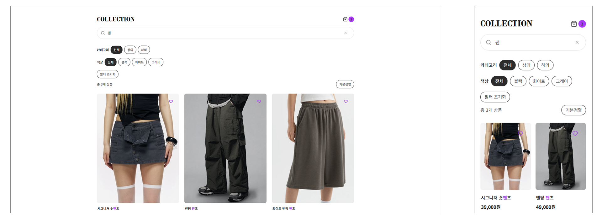

# Minimal Ecommerce Case Study

상품 탐색, 선택 상태와 장바구니 흐름을 하나의 사용자 경험으로 구성한
반응형 커머스 UI 프로젝트입니다.

---

## 1. Project Overview

## 1. Project Overview

| 항목 | 내용 |
|-----|-----|
| Project | Minimal Ecommerce |
| Type | Responsive Commerce UI |
| Role | UI Design, Interaction Planning, Responsive UI, UI QA |
| Environment | React, React Router, Vite, CSS, Context API, Vercel |
| Scope | Product List, Product Detail, Favorites, Recently Viewed, Cart |
| Status | Responsive Web / Deployed |

### My Contribution

- 상품 탐색부터 상세 확인과 장바구니까지 이어지는 사용자 흐름 설계
- 검색·필터·정렬의 화면 구조와 인터랙션 기준 정의
- 상품 옵션, 수량 선택과 상태별 UI 설계
- 관심 상품, 최근 본 상품과 장바구니의 화면 연결 방식 구성
- 반복되는 상품 UI의 시각적 일관성과 재사용 기준 정리
- 데스크톱·태블릿·모바일 반응형 화면 설계 및 CSS 조정
- 브라우저에서 기능과 상태 변화 검수
- GitHub 저장소 관리 및 Vercel 배포

## 2. Why This Project

HTML과 CSS를 중심으로 반응형 웹을 제작해 온 경험에서 확장해,
사용자의 선택에 따라 화면이 변화하는 커머스 인터페이스를
보다 구체적으로 설계하고 검증하기 위해 시작했습니다.

정적인 상품 목록을 만드는 데 그치지 않고,
검색, 필터, 상세 옵션, 관심 상품과 장바구니가
하나의 사용자 흐름으로 자연스럽게 이어지는 구조에 집중했습니다.

React 기반 구현 환경은 AI 도구를 활용해 구성했으며,
화면 구조, 인터랙션 기준과 반응형 UI를 설계하고
브라우저에서 결과를 반복적으로 검수·수정했습니다.

이 프로젝트의 목적은 프론트엔드 개발자로 전환하는 것이 아니라,
UI/UX 설계와 반응형 퍼블리싱 경험을 바탕으로
컴포넌트 기반 개발 환경에 대한 이해를 넓히는 것이었습니다.

```text
반응형 UI 설계와 퍼블리싱 경험
        ↓
상태 변화와 인터랙션 기준 정의
        ↓
React 기반 개발 환경의 결과 검수
        ↓
디자인과 구현 사이의 협업 이해 확장
```

## 3. UX/UI Goal

상품 목록 중심의 정적인 화면에서 확장해,
사용자의 탐색 조건과 선택 결과가 화면 전반에서 일관되고 명확하게 이어지는 
인터페이스를 설계하는 것을 목표로 했습니다.

### Core Goals

- 검색과 필터 조건을 쉽게 확인할 수 있는 탐색 UI
- 상품 목록에서 상세 확인까지 자연스럽게 이어지는 흐름
- 옵션, 수량과 장바구니 결과가 명확하게 보이는 상태 피드백
- 관심 상품과 최근 본 상품을 활용한 탐색 보조 경험
- 반복되는 상품 UI에 적용할 일관된 시각·인터랙션 기준
- 다양한 화면 크기에 대응하는 반응형 레이아웃

### Primary User Flow

Product Discovery
        ↓
Search / Filter / Sort
        ↓
Product Detail
        ↓
Option & Quantity Selection
        ↓
Favorites or Cart

사용자가 현재 적용한 조건과 선택한 상품 정보를 쉽게 인지하고,
앞 단계의 선택 결과가 다음 행동으로 자연스럽게 이어지도록 구성했습니다.

## 4. Product Discovery & Interaction

상품 탐색 과정에서는 사용자가 현재 적용한 조건과 결과를 쉽게 이해할 수 있도록 
검색, 필터와 정렬 상태를 명확하게 표현하는 데 집중했습니다.

### Search

검색어 입력에 따라 상품 결과가 변경되고,
입력한 키워드와 결과의 관계를 쉽게 확인할 수 있도록 구성했습니다.

검색 결과가 없을 때는 별도의 빈 상태를 제공해,
현재 조건에 맞는 상품이 없다는 사실과 다음 행동을 명확하게 안내했습니다.

구현 환경에는 연속 입력 처리를 위한 debounce가 적용되어 있으며,
검색 반응과 화면 갱신이 자연스럽게 이어지는지 브라우저에서 확인했습니다.

### Filter

카테고리와 색상 조건을 함께 선택할 수 있도록 구성했습니다.

적용한 조건은 활성 버튼과 필터 칩으로 표시해,
사용자가 현재 어떤 기준으로 상품을 탐색하고 있는지
화면에서 바로 확인할 수 있도록 했습니다.

여러 조건을 적용한 뒤 한 번에 초기화할 수 있는 흐름도 포함해,
탐색을 처음부터 다시 시작하기 쉽게 구성했습니다.

### Sort

가격 낮은순과 높은순 정렬을 제공하고,
모바일에서는 화면 공간과 조작 방식을 고려해
정렬 옵션을 바텀시트 형태로 구성했습니다.

정렬 UI에는 다음 동작 기준을 적용했습니다.

- 현재 선택된 정렬 상태 표시
- 배경 선택 시 닫기
- ESC 키를 통한 닫기
- 모달이 열린 동안 배경 스크롤 제한

구현 결과가 키보드와 모바일 환경에서도 의도대로 작동하는지 확인했습니다.

### Product Detail

상품 카드에서 상세 화면으로 이동해
이미지, 상품 정보, 옵션과 수량을 순서대로 확인할 수 있도록 구성했습니다.

상세 화면의 주요 흐름은 다음과 같습니다.

```text
상품 정보 확인
        ↓
옵션 선택
        ↓
수량 조정
        ↓
관심 상품 또는 장바구니 추가
```

단순히 정보를 보여주는 데 그치지 않고,
사용자가 선택한 옵션과 수량을 다시 확인한 뒤
다음 행동으로 이어갈 수 있도록 상태 피드백을 정리했습니다.


## 5. State Feedback & UI

사용자의 검색, 선택과 장바구니 행동이
화면에서 명확하게 확인되도록 상태별 UI와 피드백을 정리했습니다.

### Selection Feedback

검색어, 필터, 정렬, 상품 옵션과 수량처럼
현재 화면에서 선택한 값이 즉시 확인되도록 구성했습니다.

사용자가 방금 어떤 조건을 선택했는지 잊지 않도록
활성 상태, 선택 값, 결과 수와 금액 정보를 함께 표시했습니다.

### Connected Experience

관심 상품, 최근 본 상품과 장바구니처럼
여러 화면에서 이어지는 정보가 일관된 방식으로 표시되도록 구성했습니다.

구현 환경에는 Context API 기반의 공유 상태 구조가 적용되어 있으며,
상품 상세에서 선택한 결과가 장바구니와 수량 뱃지 등에
의도대로 반영되는지 검수했습니다.

```text
상품 목록
    ↓
상품 상세와 옵션 선택
    ↓
관심 상품 / 최근 본 상품 / 장바구니
    ↓
다른 화면에서도 선택 결과 확인
```

상품 상세에서 선택한 정보가 장바구니와 배지에 반영되고,
다른 페이지로 이동해도 상태가 유지되도록 구성했습니다.

### Visible Feedback

상태 변화가 코드 내부에서만 처리되지 않고 사용자에게 명확하게 보이도록 다음 피드백을 적용했습니다.

- 활성 필터와 정렬 상태
- 관심 상품 선택 상태
- 선택한 옵션과 수량
- 장바구니 상품 수 배지
- 검색 결과 개수
- 조건에 맞는 상품이 없을 때의 빈 상태

이 과정을 통해 인터랙션의 내부 처리보다,
사용자가 현재 상태와 행동 결과를 화면에서 명확히 이해할 수 있게 만드는 것이
UI 설계에서 더 중요하다는 점을 확인했습니다.


## 6. Reusable UI Structure

반복되는 상품 정보와 인터랙션이
각 화면에서 서로 다르게 보이지 않도록
공통된 UI 패턴과 재사용 기준을 정리했습니다.

### Reusable UI

주요 공통 UI는 다음과 같습니다.

- ProductCard
- ProductList
- ProductCarousel
- Filter Controls
- Sort Bottom Sheet
- Header
- Cart Badge
- Theme Toggle

상품 카드와 캐러셀은 목록, 관심 상품, 최근 본 상품과 추천 영역에서
동일한 정보 위계와 인터랙션 기준을 유지하도록 구성했습니다.

React 컴포넌트 구조는 AI 보조 구현을 통해 적용했으며,
각 화면에서 시각적 규칙과 사용 방식이 일관되게 유지되는지 검수했습니다.

### Implementation Considerations

React 기반 구현 환경에는 다음 처리가 적용되었습니다.

- 검색 입력 debounce
- 검색·필터·정렬 결과의 memoization
- 이미지 lazy loading
- 반복되는 캐러셀 UI의 공통 구조

이 처리는 AI 보조 구현 과정에서 적용되었으며,
사용자가 상품을 탐색할 때 화면 반응과 이미지 로딩이
사용 흐름을 방해하지 않는지 확인하는 데 중점을 두었습니다.

## 7. Responsive Design

데스크톱 화면을 단순히 축소하는 방식이 아니라,
화면 크기와 사용 환경에 따라 탐색 방식, 콘텐츠 밀도와 조작 방식을 조정했습니다.

### Desktop

- 상품 목록과 필터 조건을 넓은 화면에서 함께 확인
- 여러 상품을 비교하기 쉬운 카드 배열
- 주요 탐색 조건과 결과 수를 한 화면에 배치

### Tablet

- 화면 너비에 맞춰 카드 수와 콘텐츠 간격 조정
- 필터와 정렬 영역의 밀도 축소
- 터치 환경을 고려한 버튼과 선택 영역 조정

### Mobile

- 필터와 정렬을 모바일 조작 방식에 맞게 재구성
- 버튼과 선택 영역의 터치 범위 확보
- 상품 정보의 우선순위를 조정해 핵심 정보부터 노출
- 상세 화면과 장바구니의 세로 흐름 최적화

320px 너비까지 확인하며
텍스트, 버튼, 상품 카드, 모달과 바텀시트가 화면 밖으로 벗어나지 않는지 검수했습니다.

### Responsive Decisions

반응형 작업에서는 단순한 열 개수 변경보다
각 화면에서 사용자가 어떤 정보를 먼저 보고 어떤 동작을 수행하는지에 집중했습니다.

특히 모바일에서는 필터와 정렬을 화면 안에 계속 노출하기보다
필요할 때 열어 사용하는 방식으로 전환하고,
상품 정보와 주요 행동 버튼이 자연스럽게 이어지도록 순서를 조정했습니다.



## 8. Outcome & Reflection

### Outcome

이 프로젝트를 통해 상품 탐색, 상세 확인, 관심 상품과 장바구니가
하나의 흐름으로 이어지는 반응형 커머스 UI를 완성했습니다.

주요 결과는 다음과 같습니다.

- 검색, 필터와 정렬 조건이 명확하게 드러나는 탐색 UI
- 상품 선택과 장바구니 결과를 확인할 수 있는 상태 피드백
- 반복되는 상품 영역에 일관된 정보 위계와 UI 기준 적용
- 데스크톱, 태블릿과 모바일 환경에 맞춘 반응형 화면
- 실제 브라우저에서 동작과 화면 결과를 검수할 수 있는 배포 환경 구성

### Reflection

이 프로젝트를 통해 커머스 UI에서는
사용자의 선택과 그 결과가 화면에서 명확하게 이어지는 것이 중요하다는 점을 확인했습니다.

검색 조건, 선택한 옵션과 장바구니 상태가 서로 단절되지 않고
다음 행동으로 자연스럽게 연결되어야 사용자가 현재 상황을 이해할 수 있었습니다.

또한 모바일에서는 데스크톱 화면을 단순히 축소하는 것이 아니라,
필터와 정렬 방식, 정보 우선순위와 버튼 배치를
사용 환경에 맞게 다시 구성해야 한다는 기준을 정리했습니다.

React 기반 구현 환경을 검수하는 과정에서는
컴포넌트와 상태 변화가 실제 화면에 반영되는 방식을 확인하고,
UI 기준과 구현 결과 사이의 차이를 조정하는 경험을 넓혔습니다.

## Project Context

이 프로젝트는 개인 포트폴리오 목적으로 제작했습니다.

정보구조, 사용자 흐름, UI 디자인, 반응형 기준과 콘텐츠를 직접 구성했으며,
React 기반 구현은 AI 도구를 활용했습니다.
브라우저에서 인터랙션, 상태 변화와 반응형 결과를 반복적으로 검수하고
HTML/CSS와 UI를 수정했습니다.

## 🔗 Live Demo

http://minimal-ecommerce-psi.vercel.app